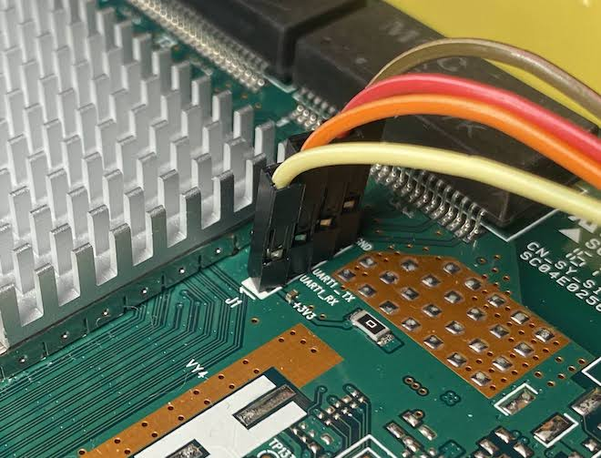

# Opensourcing the hardware (Investigation stage: WIP)


## OEM Firmware

Included here is an OEM OTA update: `13782324_ES5000_HG2380_02_07_03_48.bin`
for Tilgin 2381 (and by all indications 238x). 

To extract it:
```bash
tar -xf 13782324_ES5000_HG2380_02_07_03_48.bin`
```

Inside are the UBI images, including:
`rootfs.img`, `appfs.img` (empty), `uImage` (kernel)


the `.img` files are squashfsv2.1 FS

change `sqlz` (`73 71 6C 7A`) magic to `sqsh` (`73 71 73 68`).

```bash
echo 73 71 73 68 | xxd -r -p -o 0 - rootfs.img
echo 73 71 73 68 | xxd -r -p -o 0 - appfs.img
```

Some archivers won't like it. Keka handles it fine. 


## UART Serial

A serial UART `J1` is available on the 2381 board beside the heatsink, 'above'
the LAN1 and 2 ethernet buffer chips. `+3.3V`, `UART1_RX`, `UART1_TX`, `GND`.



Connect your Serial adaptor `TX` to `UART1_RX`, and `RX` to `UART1_TX` and 
also `GND` to `GND`.


## Hardware

According to some hardware wikis, the hardware in the HG238x is very similar to
 [D-Links DWR-966](https://deviwiki.com/wiki/D-Link_DWR-966) for which 
D-Links source is available [here](https://github.com/brunompena/dwr-966/). 
The DWR-966 lacks a dedicated WAN port and phone/DECT ports, but has a GSM module
and a SIM port.


## DTS

A corresponding DTS file for the DWR-966 (above) appears to be
`target/linux/lantiq/image/dts/P02003.dts`, which describes a demo board.
The serial port is listed as `J8`. So some differences from the 2381 can be
expected, but the chipset looks identical.


## Data Encryption Unit

The `/dev` character devices present in the 2381 OEM firmware indicate that
crypto hardware accelerators are available, for mostly deprecated cryptos:
(3)DES, AES, MD5, SHA1, ARC4, and their corresponding HMACs. Likely for IPsec.
Search bootlogs for `IFX DEU` (Data Encryption Unit). Not bad to have.
Kernel drivers appear to be available for it. 
See [here](https://lore.kernel.org/all/20210914212105.76186-3-olek2@wp.pl/)
and [here (old original driver)](https://github.com/usnistgov/pscr-openwrt-fork/tree/master/package/kernel/lantiq/ltq-deu/src) and [here (openwrt git)](https://github.com/openwrt/openwrt/commit/e85180d90ed01ef4fb89675702622a9cabf3b092). Uncertain whether the driver is still
[disabled in newer kernels](https://github.com/openwrt/openwrt/pull/4326).


## Cellular / GSM

Bootlogs suggest that at least drivers are included for USB GSM dongles. Board
inspection reveals an absence of anything built in to the HG2381. The Zyxel has
one, however.


## DECT/FXS 

A Lantiq (now Intel) FXS chip is included in the HG2381 devices. 
A `S613NN81, SLL98` (Batch, part number).
Other devices in the wild have similar chips. This manages the two RJ11 phone
sockets. A 2384 (HKBN) includes a `S633NN58, SLL98`. Datasheet as usual 
[unavailable](https://www.avnet.com/shop/us/products/intel/pef42168vv12-s-ll9a-3074457345636172839/).
[A forum post](https://forum.openwrt.org/t/tilgin-hg2381-uk/37714/3) documents 
an `S828NN26, SLL98` on a UK market model.

It seems a Lantiq VR9 kernel driver exists for the chip. You may need to dump
the <1MB firmware blob for the FXS chip. [See here](https://openwrt-devel.openwrt.narkive.com/5eaKkB3x/patch-00-11-prepare-support-for-fxs-to-vr9-and-support-vgv7519-board).


## USB EHCI PCI

At least two USB ports are available on the HG2381, and bootlogs show the EHCI
controller.

* USB1 (back)
* USB2 (side)


## GPIOs

### HG2384

The 2384 (HKBN) bootlog reveals:
```
gpio-stp-xway 1e100bb0.stp: Init done
...
gpio-export gpio-export.8: 1 gpio(s) exported
...
tilgin-hg-ltq-gphy tilgin-hg-ltq-gphy.9: gpio_base=166
...
gpio 183 (name 3:green)
gpio 184 (name 3:red)
gpio 180 (name 4:green)
gpio 181 (name 4:red)
gpio 192 (name 5:green)
gpio 179 (name 5:red)
gpio 220 (name 6:green)
gpio 187 (name 7:green)
gpio 188 (name 7:red)
gpio 193 (name 8:green)
gpio 186 (name 8:red)
gpio 185 (name 1:red)
gpio 191 (name 6:red)
```

The 2384 has 7 multicolour LEDs on the front panel, from left to right:
* Power (booting, booted)
* WAN
* LAN
* WiFi
* USB
* Telephone
* DECT

The 2384 PCB has two push buttons. 
* "reset" (S2) 
* "wifi" (S4)
* "calling?" (S3)

There are calling icon  on the case of the button.I am have not idea what mean assueming that is mean calling.


### HG2381

The 2381 bootlog reveals:

```
on-off-sw-gpio:0
on-off-sw-gpio:1
on-off-sw-gpio:2
on-off-sw-gpio:3
on-off-sw-gpio:4
...
danube-gpio danube-gpio.0: gpio_base=0
danube-gpio danube-gpio.1: gpio_base=16
danube-gpio danube-gpio.2: gpio_base=32
Lantiq Danube/Twinpass/Vinax LED controller GPO
danube-ledc-gpo danube-ledc-gpo: gpio_base=64
...
GPIO-based on/off switch with auto-off
...
tilgin-hg-ltq-gphy: gpio_base=96
...
Registered led device: 1:red
Registered led device: 3:green
Registered led device: 3:red
Registered led device: 4:green
Registered led device: 4:red
Registered led device: 5:green
Registered led device: 5:red
Registered led device: 6:red
Registered led device: 6:green
Registered led device: 7:red
Registered led device: 7:green
Registered led device: 8:red
Registered led device: 8:green
```

The 2381 has 7 multicolour LEDs on the front panel, from left to right:
* Power (booting, booted)
* WAN
* LAN
* WiFi
* USB
* Telephone
* Extra (DECT?)

The 2381 PCB has two push buttons. 
* "reset" (S2) 
* "WiFi" (S4)
* empty position S3


## Contact / Further info.

If you have any datasheets for the chipsets, open an issue here or reach out to
me on my email (see any commit) :)
